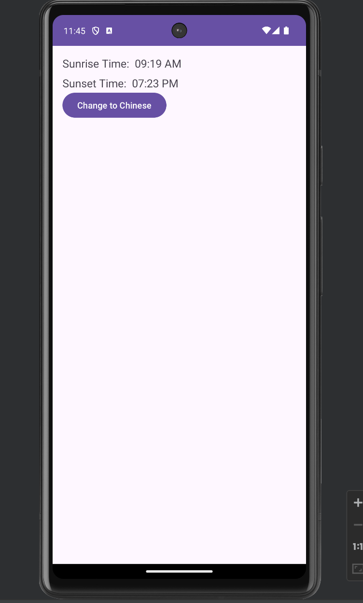
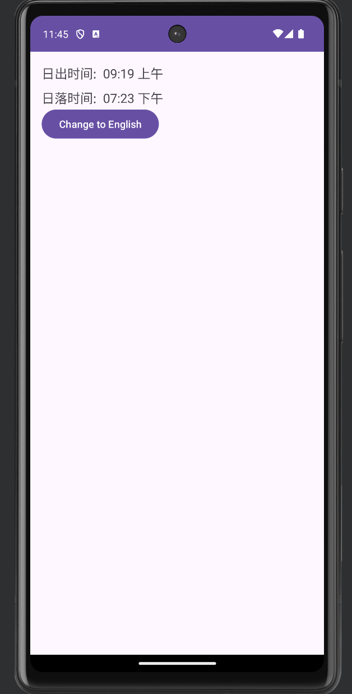

# SunriseSet

This app uses sunrise-sunset api to fetch the sunrise and sunset time of a location.

## Table of Contents

- [Description](#description)
- [Installation & Running](#installation-And-running)
- [Screenshots](#screenshots)

## Description

This app uses localization to change the languages in android app.

## Installation And Running

- Clone the project
- Open it in your local IDE (Android Studio, IntelliJ)
- Install the dependencies and run the project using your android emulator or connected device.

## Screenshots

Some of the screens of the application are:

### English

### Chinese

